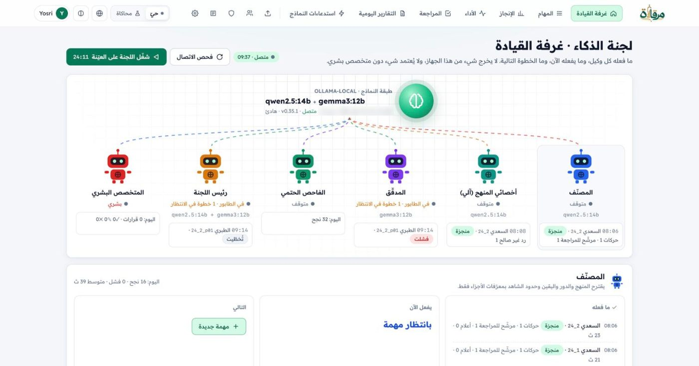
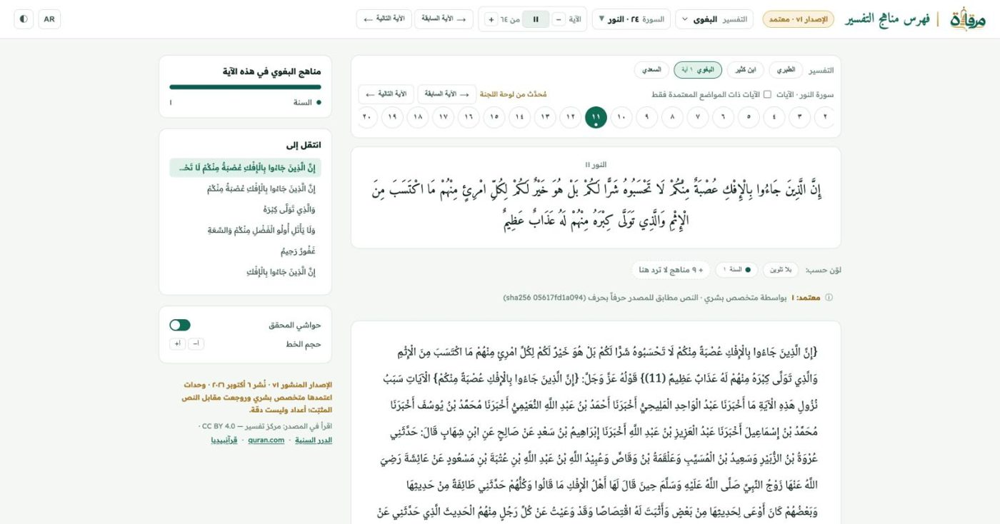

# مِرْقاة — فهرس مناهج التفسير

منهج المفسّر ظاهراً على نصّه: كل وسم بشاهده وموضعه، تقترحه لجنة وكيلين، ولا يُعتمد إلا بقرار متخصص.

**الفريق 840 · المسار ٠٤ — أدوات المعرفة والتحقق**

**القارئ:** https://mirqah.app · **لوحة اللجنة:** https://console.mirqah.app · للمحكّمين قراءة فقط: https://console.mirqah.app/judges

## جرّبه الآن

| لوحة اللجنة (`console.mirqah.app`) | القارئ العام (`mirqah.app`) |
|---|---|
| [](https://console.mirqah.app) | [](https://mirqah.app) |

- [القارئ](https://mirqah.app/reader): اختر التفسير، وتصفّح مواضع المنهج وشواهدها.
- [الواجهة الكلاسيكية](https://mirqah.app/fahras.html): النص الأصل بجانب العرض الملوّن.
- [لوحة اللجنة](https://console.mirqah.app): متابعة الاقتراح والتدقيق والإحالة؛ [دخول الحكّام للقراءة فقط](https://console.mirqah.app/judges).

## النطاق

سورة النور: **٦٤ آية × ٤ تفاسير** (الطبري، ابن كثير، البغوي، السعدي) في **٢٩٦ نافذة** تحت `data/nur/`. طابق التحقق الحرفي النصَّ المصدر في **76,773 من 76,773 حرفاً**. هذا فحص لسلامة نقل النص وتقسيمه، وليس حكماً على صحة الوسوم.

**الحالة (٦ أكتوبر ٢٠٢٦):** تشغيل اللجنة والمراجعة المعمّاة جاريان في اللوحة؛ **المنشور v1** = ما اعتمده متخصص بعد مقارنة المصدر (أعداد لا دقة — [`docs/EVALUATION.md`](docs/EVALUATION.md)).

## كيف يعمل

1. يُثبَّت نص المصدر ببصمة `SHA-256`، ثم تقسّمه الشفرة إلى أجزاء ذات معرّفات.
2. يقترح المصنّف `qwen2.5:14b` الحدود والوسوم والشواهد بمعرّفات الأجزاء فقط؛ يعيد المدقّق الأعمى `gemma3:12b` النظر من عائلة نماذج أخرى. يعمل النموذجان محلياً عبر Ollama.
3. يتحقق رئيس اللجنة، وهو شفرة بقواعد ثابتة، من عتبة الترشيح **85**، واختلاف عائلتي النموذجين، وتطابق بصمتي الحزمة. يخرج **مرشّحاً للمراجعة** أو **إحالة برمز سبب واحد**.
4. تعيد الشفرة بناء النص من الأجزاء المثبّتة وتفحصه حرفاً بحرف. المتخصص البشري في اللوحة وحده يقرّر الاعتماد / يحتاج تعديلاً / رفض بعد مقارنة الشاهد بالمصدر؛ والمشرف العام ينشر لقطة مرقّمة؛ ولا يعرض القارئ العام سوى تلك اللقطة.

**وكيلان من عائلتين يقترحان، وأخصائيون آليون يحجبون فقط** (`method/profiles/` و`src/specialist.py`). لم نعدّل أوزان النموذج؛ نوجّهه بالسياق. مراجعة A/B معمّاة: يرى المتخصص المسارين دون معرفة أيهما أيّ مسار.

```
المصدر المثبَّت ─► أجزاء (كود) ─► مصنِّف بمعرّفات الأجزاء فقط
     ─► مدقِّق مستقل (عائلة أخرى) ─► الفاحص الحتمي
     ─► رئيس اللجنة (كود، عتبة 85، رمز سبب واحد)
     ─► المتخصص في اللوحة ─► المشرف العام ينشر ─► mirqah.app يقرأ اللقطة فقط
```

## النتائج

التشغيل الحقيقي المقصود هنا هو **المهمة ٥** في لوحة اللجنة، على النور **٢٤:١١**: **١١ نافذة، ٧٧ خطوة**. نتائج التوجيه من سجل المهمة نفسها:

| الحالة | العدد |
|---|---|
| مرشّح للمراجعة | يُحدَّث من المهمة ٥ |
| إحالة إلى المتخصص | يُحدَّث من المهمة ٥ |

**أعداد توجيه وليست دقة.** لا يصبح أي مرشّح معتمداً إلا بقرار بشري موثّق بعد مقارنة المصدر.

## نسخة البداية (قبل ٤ أكتوبر ٢٠٢٦)

هذا المستودع يوثّق العمل السابق قبل ٤ أكتوبر ٢٠٢٦ كما تشترط المسابقة. نسخة البداية هي الالتزام [`ec616f4`](https://github.com/yyahmed82/tafsir-methods-index/tree/ec616f4) ، آخر دمجٍ لعمل ٣ أكتوبر، وقد دُمج في ٤ أكتوبر ٢٠٢٦ الساعة ٠٠:٢٧ بتوقيت الرياض (21:27 UTC في ٣ أكتوبر). نحتسب كل ما فيه، بما فيه تحضير نص سورة النور وواجهة القارئ v2، من نسخة البداية لا من أعمال أيام التحدي.

احتوت نسخة البداية، كما يظهر من `git log --first-parent ec616f4` و[README في ذلك الالتزام](https://github.com/yyahmed82/tafsir-methods-index/blob/ec616f4/README.md)، على تجربة ابن كثير المبكرة، وتشغيل لاحق على ثلاث آيات عبر أربعة تفاسير، وواجهة القارئ v2، وإصلاحات التدقيق للبناء الحتمي و`textcore` وحارس CI، وتجهيز نص سورة النور **64×4** و**296 نافذة** مع فحص مطابقة حرفي صارم، وموارد الفريق. أرقام تلك التجارب محفوظة في README عند ذلك الالتزام ولا تُنقل هنا كنسب نتائج حالية.

**تطوّر النطاق:** وصف عرض التسجيل التطبيق على سورة الأنفال / al-Anfal (تفسير الطبري)؛ وفي أيام التحدي وُسّع النطاق إلى سورة النور / An-Nur بأربعة تفاسير (الطبري، ابن كثير، البغوي، السعدي) لتظهر المقارنة بين المناهج على الآيات نفسها. الفكرة والمنهج والمسار كما هي.

جاءت النسخة السابقة من المستودع العام [fahras-manahij-al-tafsir](https://github.com/drkhaledalrefay-coder/fahras-manahij-al-tafsir)، وهو يوجّه الآن إلى هذا المستودع.

## ما أُنجز في أيام التحدي (٤–٦ أكتوبر)

- عقد الإسناد، [PR #9 في المستودع السابق](https://github.com/drkhaledalrefay-coder/fahras-manahij-al-tafsir/pull/9) (دُمج ٤ أكتوبر ١٠:٠١ بتوقيت الرياض).
- رئيس اللجنة، [PR #10 في المستودع السابق](https://github.com/drkhaledalrefay-coder/fahras-manahij-al-tafsir/pull/10) (دُمج ٤ أكتوبر ١٠:٠٦ بتوقيت الرياض).
- مهارة الفهرسة، PR #1.
- هوية «مِرْقاة» وروابط المصدر وإمكانية الوصول، PR #2.
- لوحة اللجنة والمهمة ٥ والقارئ العام، PR #3 (دُمج في main).
- الشعار، PR #4.
- ترخيص MIT ومرجع «آيات»، PR #10.
- `CODEOWNERS` لمراجعة المالك.

قيد الدمج: عرض رمز الامتناع، PR #5؛ تطبيق تجربة الاستخدام و«اعرض الأصل بجانبه»، PR #14. يمكن التحقق من الفرق عبر [مقارنة نسخة البداية مع main](https://github.com/yyahmed82/tafsir-methods-index/compare/ec616f4...main).

## الأدوات والنماذج

| الاستخدام | الأداة/النموذج |
|---|---|
| تشغيل اللجنة الآن | `qwen2.5:14b` مصنّفاً و`gemma3:12b` مدقّقاً عبر Ollama محلياً |
| تجارب نسخة البداية | DeepSeek v4.1 flash، MiMo v2.6 flash، Codex `gpt-6-sol`، Grok |
| أدوات التطوير | Codex، Cursor/Grok، Gemini/AGY، Claude، Cline |

الإفصاح عن الحقوق: الكود بترخيص MIT؛ النصوص من مركز تفسير بترخيص CC BY 4.0 وفق الشروط في [ATTRIBUTION.md](ATTRIBUTION.md)؛ لا نصوص من «آيات». سجل الأدوات مفصّل في [الإفصاح عن الذكاء الاصطناعي](docs/AI_DISCLOSURE.md).

## المصادر وتوثيقها

النصوص من النسخة الرقمية لمجموعة [مركز تفسير للدراسات القرآنية](https://huggingface.co/datasets/tafsircenter/tafsir-mcp-data)، المثبّتة في مسار المعالجة ببصمة المصدر. لا تحدد وثائق المصدر طبعة مطبوعة للتفاسير الأربعة.

| التفسير | المصدر | الطبعة/النسخة | الترخيص |
|---|---|---|---|
| الطبري | مركز تفسير، `tafsir_tabary` | نسخة رقمية؛ الطبعة المطبوعة: يُستكمل | CC BY 4.0 |
| ابن كثير | مركز تفسير، `tafsir_katheer` | نسخة رقمية؛ الطبعة المطبوعة: يُستكمل | CC BY 4.0 |
| البغوي | مركز تفسير، `tafsir_baghawy` | نسخة رقمية؛ الطبعة المطبوعة: يُستكمل | CC BY 4.0 |
| السعدي | مركز تفسير، `tafsir_saadi` | نسخة رقمية؛ الطبعة المطبوعة: يُستكمل | CC BY 4.0 |

[«آيات» (جامعة الملك سعود)](https://quran.ksu.edu.sa) مرجع قراءة مرتبط، لا يُنسخ نصه. الكود بترخيص [MIT](LICENSE)، أما النص والبيانات المشتقة فتخضع للشروط المفصّلة في [توثيق المصادر والتراخيص](ATTRIBUTION.md)، بما فيها النسب واشتراط الإذن المسبق لإعادة التوزيع التجاري.

## التثبيت المحلي في أمر واحد

يثبّت لوحة اللجنة والقارئ ومحرّك ذكاء محلياً (Ollama) على Ubuntu/Debian أو WSL2 أو macOS، ويختار حجم النماذج حسب ذاكرة الجهاز. التفاصيل في [`docs/INSTALL.md`](docs/INSTALL.md). النشر على خادم: [`deploy/README.md`](deploy/README.md).

```bash
curl -fsSL https://raw.githubusercontent.com/yyahmed82/tafsir-methods-index/main/install.sh | bash
```

| المستوى | الذاكرة | النماذج |
|---|---|---|
| `full` | 16 GB | `qwen2.5:14b` + `gemma3:12b` |
| `lite` | 8 GB | `qwen2.5:3b` + `gemma3:1b` |
| `none` | 4 GB | بلا نموذج، وضع المحاكاة فقط |

بعد التثبيت: اللوحة على http://localhost:8800 والقارئ على http://localhost:8080. فحص دون تثبيت: `bash install.sh --check`.

## التشغيل محلياً (للمطوّرين)

يتطلب Python 3.11 أو أحدث. من جذر المستودع:

```bash
pip install -r requirements.txt -r console/requirements.txt
python src/v2_selftest.py
python -m pytest -q
python -m console --port 8800
```

معاينة الموقع العام: `python -m http.server 8080 --directory site`. تفاصيل إعادة البناء في [دليل التشغيل](docs/RUN.md)، وتشغيل التصنيف في [دليل الذكاء الاصطناعي](docs/AI_RUN.md). لا يتضمن المستودع قاعدة المصدر `quran.db`.

## الوثائق

| الوثيقة | ماذا تجيب |
|---|---|
| [`docs/MODEL_CARD.md`](docs/MODEL_CARD.md) | النماذج، ما تستلمه وما تُرجعه، درجة الفاحص وعتبة الرئيس |
| [`docs/DATA_CARD.md`](docs/DATA_CARD.md) | مصدر النص، التثبيت والتقطيع، الأعداد، الترخيص |
| [`docs/EVALUATION.md`](docs/EVALUATION.md) | سلامة النص، أعداد التوجيه، نتائج المراجعة — بلا ادعاء دقة |
| [`docs/AI_DISCLOSURE.md`](docs/AI_DISCLOSURE.md) | كل نموذج وأداة وما فعله كلٌّ منها |
| [`SECURITY.md`](SECURITY.md) | المصادقة، البيانات المحفوظة، الأسرار، الإبلاغ |
| [`docs/INSTALL.md`](docs/INSTALL.md) · [`docs/WORKFLOW.md`](docs/WORKFLOW.md) · [`deploy/README.md`](deploy/README.md) | التثبيت، سير المراجعة، النشر |

## للمساهمين

اعمل على فرع مستقل ← افتح طلب دمج (PR) ← اجتز CI ← انتظر مراجعة المالك. لا تعدّل `main` ولا تمسّ ملفات `data/` المصدرية أو المشتقة يدوياً. ابدأ بـ[دليل المساهمة](CONTRIBUTING.md)، و[قواعد الوكلاء](AGENTS.md)، و[مهارات الفريق](docs/team/SKILLS.md).

مسارات أساسية: `console/` لوحة اللجنة · `site/` القارئ العام · `src/` خط المعالجة · `deploy/` أدوات الخادم.

وثائق إضافية: [تعليمات Claude](CLAUDE.md) · [المهام التالية](docs/HANDOFF.md) · [تدقيق المشروع](docs/AUDIT_2026-10-02.md) · [قائمة التسليم](docs/SUBMISSION_CHECKLIST.md) · [سكربت العرض](docs/DEMO_SCRIPT.md) · [صيغة البيانات](docs/DATA_FORMAT.md).

## English summary

**Mirqah — Tafsir Methods Index** makes a commentator’s method visible at its location in the source text, with a traceable witness for each proposed tag.
**Live:** https://mirqah.app · **Committee console:** https://console.mirqah.app · Judges (read-only): https://console.mirqah.app/judges
Team 840 · Track 4, Knowledge and Verification Tools.
The al-Nur scope covers 64 verses, four tafsirs, and 296 windows; the source text matched in 76,773 of 76,773 characters.
Two different local Ollama model families propose and check span ID based annotations; deterministic code checks the source and routes candidates or referrals; a human specialist decides; a super admin publishes; the public reader shows only that snapshot.
Task 5 covers al-Nur 24:11, with 11 windows and 77 steps. Routing counts are not accuracy measures.
One-command install is in the Arabic section above (raw GitHub URL on `main`).
Starting version: [`ec616f4`](https://github.com/yyahmed82/tafsir-methods-index/tree/ec616f4) (merged 4 Oct 2026, 00:27 Riyadh). Challenge work: [compare ec616f4...main](https://github.com/yyahmed82/tafsir-methods-index/compare/ec616f4...main). Scope evolved from al-Anfal (registration) to An-Nur × 4 tafsirs.
Code is MIT licensed; tafsir text and derived data follow [ATTRIBUTION.md](ATTRIBUTION.md). See also [`docs/MODEL_CARD.md`](docs/MODEL_CARD.md), [`docs/DATA_CARD.md`](docs/DATA_CARD.md), [`docs/EVALUATION.md`](docs/EVALUATION.md), [`SECURITY.md`](SECURITY.md).
